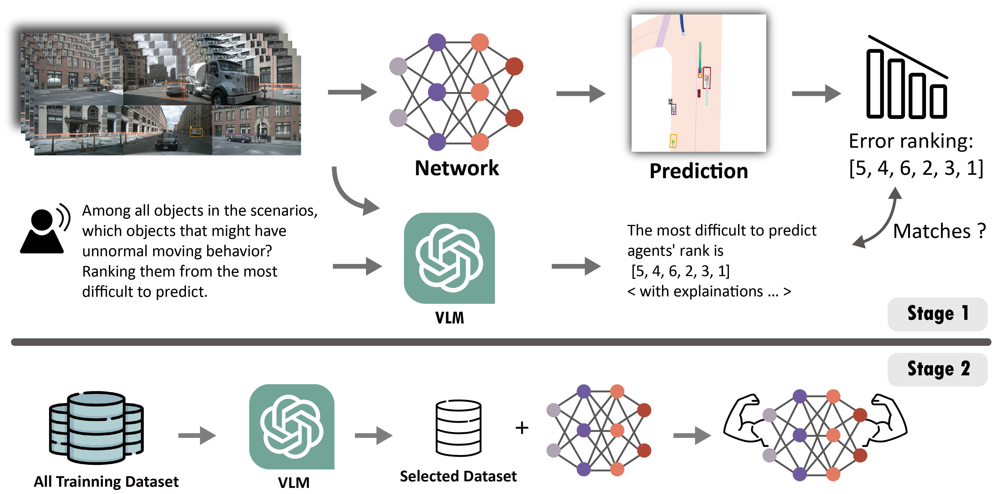
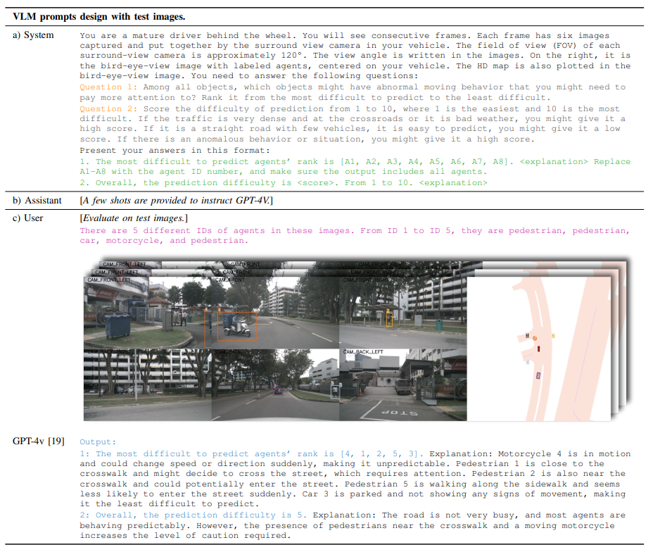

Hard Cases Detection in Motion Prediction by Vision-Language Foundation Models
---
[](https://arxiv.org/abs/2405.20991) 
<!-- | [Poster]() -->

Addressing hard cases is challenging due to the sparsity and high variability​. Unlike existing methods such as collecting more real-world data which is expensive, creating synthetic data with deep generative models conditioned on specific needs or manipulating the 3D reconstructed environment (like moving/adding road users) which requires much human intervention, incremental learning which depends on the network training,
we try to find a more explainable and independent method.
Vision-Language Foundation Models (VLMs) have shown remarkable zero-shot capabilities as being trained on extensive datasets.
This work explores the potential of VLMs in detecting hard cases in autonomous driving.
We demonstrate the capability of VLMs such as GPT-4v in detecting hard cases in traffic participant motion prediction on both agent and scenario levels.
We introduce a feasible pipeline where VLMs, fed with sequential image frames with designed prompts, effectively identify challenging agents or scenarios, which are verified by existing prediction models.
Moreover, by taking advantage of this detection of hard cases by VLMs, we further improve the training efficiency of the existing motion prediction pipeline by performing data selection for the training samples suggested by GPT.
We show the effectiveness and feasibility of our pipeline incorporating VLMs with state-of-the-art methods on NuScenes datasets. 


The framework has 2 stages. 
<center>

</center>


- Stage 1: Agent-level
    - Verify the ability of VLM to detect hard cases
    - using existing motion prediction NN as ground truth

- Stage 2: Scene-level
    - Improve training efficiency by training the network with a smaller subset of data selected by VLM. 

## Prompt Design
<center>

</center>

Code and processed dataset will be public around July. Stay tuned :)


### Cite Our Paper
```bash
@inproceedings{yang2024hard,
  author={Yang, Yi and Zhang, Qingwen and Ikemura, Kei and Batool, Nazre and Folkesson, John},
  booktitle={2024 IEEE Intelligent Vehicles Symposium (IV)}, 
  title={Hard Cases Detection in Motion Prediction by Vision-Language Foundation Models}, 
  year={2024},
  pages={2405-2412},
  doi={10.1109/IV55156.2024.10588694}
}
```
